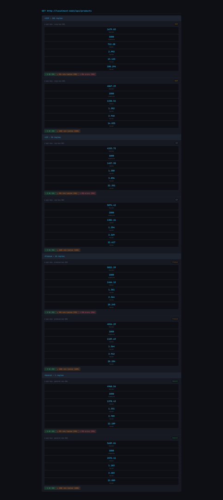
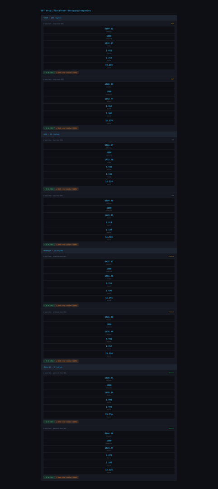
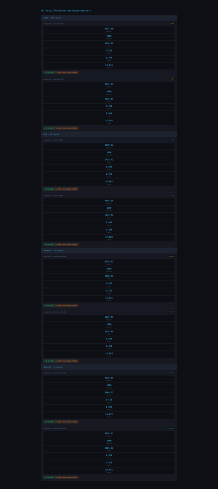
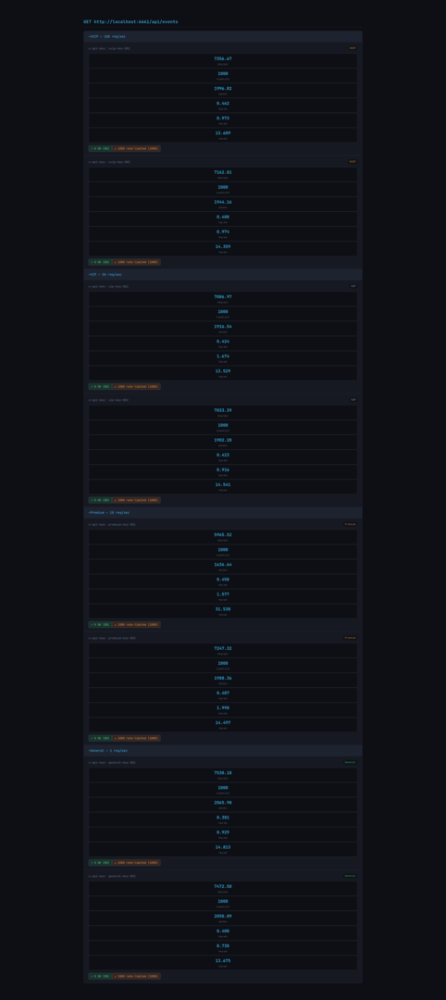
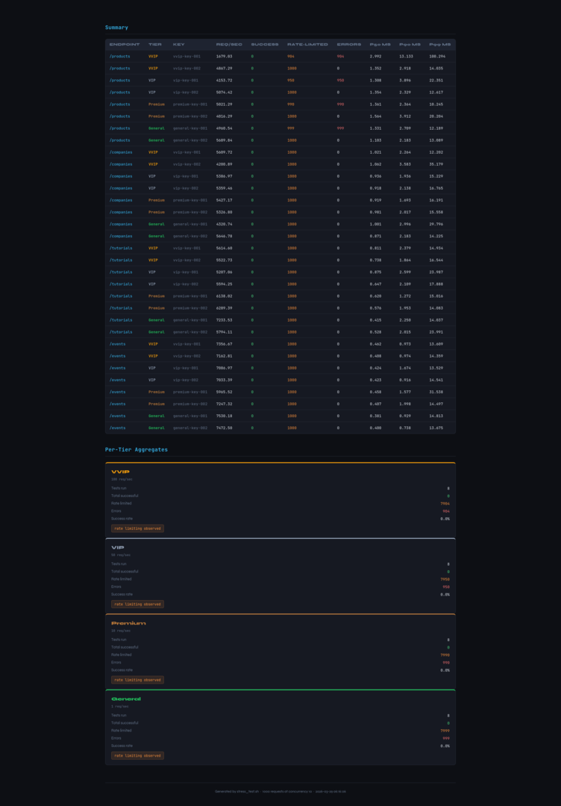

# Java Spring Boot Sql2o REST CRUD

A RESTful API application built with Spring Boot 4, Sql2o, Flyway, and MySQL for managing products, companies, tutorials, and seat reservations.

## Latest Updates (v0.4.0) - Resilience4j Annotations & Sql2o Transactions

### 🔧 Resilience4j Annotation-Based Configuration

- **Removed manual bulkhead management** - Now using `@Bulkhead` and `@Retry` annotations
- **Spring Boot 4 auto-configuration** - Leverages `resilience4j-spring-boot4` starter
- **Declarative resilience** - Annotations clearly show which methods have protection
- **Simplified service code** - No more `BulkheadUtils` wrapper methods
- **Easier testing** - No need to mock Bulkhead/Retry objects

```java
@Bulkhead(name = "database")
@Retry(name = "database")
public Reservation reserveSeats(UUID eventId, String customerName, int seatCount) {
    // Business logic with automatic bulkhead and retry protection
}
```

### 💾 Sql2o Transaction Management

- **Replaced `@Transactional`** - Spring's `@Transactional` doesn't work with Sql2o
- **Custom `executeInTransaction()`** - Explicit Sql2o transaction management
- **Proper commit/rollback** - Automatic rollback on exceptions
- **Clean separation** - Transaction boundaries clearly defined in repositories

```java
public <T> T executeInTransaction(Supplier<T> action) {
    try (Connection conn = sql2o.beginTransaction()) {
        T result = action.get();
        conn.commit();
        return result;
    } catch (Exception e) {
        log.error("Transaction failed: ", e);
        throw e;
    }
}
```

### 📦 Dependency Changes

- **Removed**: `resilience4j-bulkhead` (included in spring-boot4 starter)
- **Removed**: `BulkheadConfiguration.java` (auto-configured)
- **Removed**: `BulkheadUtils.java` (replaced by annotations)

---

## Latest Updates (v0.3.0) - Race Condition Prevention

### 🎯 Seat Reservation System Overhaul (Based on race.txt Best Practices)

#### Deadlock Prevention

- **`SELECT FOR NO KEY UPDATE`**: Better concurrency than `FOR UPDATE`
- **`ORDER BY id ASC`**: Consistent lock ordering prevents circular waits
- **`SKIP LOCKED`**: Non-blocking lock acquisition for high concurrency

#### Two-Phase Reservation

- **Status-based management**: `available` → `reserved` → `booked`
- **10-minute hold duration**: Temporary hold with `held_until` timestamp
- **Reservation statuses**: `pending` → `confirmed`/`cancelled`/`expired`
- **Confirm endpoint**: `/api/v1/reservations/{id}/confirm`

#### Optimistic Locking

- **`version` column**: Auto-incremented on each update
- **Conditional updates**: Detects concurrent modifications without blocking
- **Automatic retry**: On version mismatch

#### Partial Rollback

- **Compensating transactions**: Failed multi-seat reservations release locked seats
- **Atomic operations**: All-or-nothing reservation logic

#### Background Jobs

- **Expiration scheduler**: Releases expired reservations every 60 seconds
- **Automatic cleanup**: Prevents seat hoarding

### 📊 New Schema Components

- **`reservation_seats` junction table**: Many-to-many relationship
- **`status` enum**: `'available'`, `'reserved'`, `'booked'`
- **`held_by`**, **`held_until`**: Track temporary holds
- **Partial indexes**: Optimized for expiration cleanup

---

## Latest Updates (v0.2.0)

### 🐛 Bug Fixes

- **Fixed race condition in seat reservation** - Added proper transaction management with automatic rollback
- **Fixed silent transaction failures** - Repository now throws exceptions instead of returning error codes
- **Fixed Redis rate limiter initialization** - Added fallback initialization for missing rate limiters
- **Fixed resource leaks** - All Query objects now use try-with-resources

### ⚡ Performance Improvements

- **Reduced connection pool size** - From 151 to 30 (configurable via `HIKARI_MAX_POOL_SIZE`)
- **Optimized logging** - Changed repository SQL logging from INFO to DEBUG
- **Improved random selection** - Data seeder uses SQL `ORDER BY RAND()` instead of loading all IDs

### 🔒 Security & Validation

- **Added input validation** - All request bodies now validated with Bean Validation (`@Valid`)
- **Added pagination limits** - Max page size of 100 to prevent DoS attacks
- **Added request size limits** - Max 1MB request body size
- **Secure error handling** - Internal error details no longer exposed to clients
- **Configurable CORS** - Changed from wildcard to configurable via `CORS_ALLOWED_ORIGINS`

### 🏗️ Architecture Improvements

- **API versioning** - All endpoints now use `/api/v1/` prefix
- **Retry logic** - Added Resilience4j retry with exponential backoff for transient failures
- **Cluster-aware scheduler** - Data seeder now runs on single instance only

### 📝 Testing

- **Added integration tests** - Comprehensive seat reservation flow tests
- **All 102 tests pass** - 80%+ code coverage maintained

---

## Tech Stack

| Technology        | Version   | Purpose                                    |
| ----------------- | --------- | ------------------------------------------ |
| Java              | 21        | Runtime                                    |
| Spring Boot       | 4.0.5     | Framework                                  |
| Redisson          | 4.3.0     | Distributed rate limiting with Redis       |
| Resilience4j      | 2.4.0     | Bulkhead for concurrency control           |
| Sql2o             | 1.9.1     | Database access layer                      |
| ElSql             | 1.3       | SQL management                             |
| MySQL Connector/J | 9.6.0     | MySQL driver                               |
| Flyway            | (managed) | Database migration                         |
| HikariCP          | (managed) | Connection pooling                         |
| Lombok            | (managed) | Boilerplate reduction                      |
| Jackson           | (managed) | JSON serialization                         |
| Logback           | (managed) | JSON logging with traceId                  |
| Virtual Threads   | Java 21   | Lightweight threading for high scalability |

## Project Structure

```text
src/main/java/com/otis/
├── Application.java                    # Main entry point
├── config/
│   ├── DatabaseConfig.java           # Sql2o configuration
│   ├── BulkheadConfig.java            # Resilience4j bulkhead configuration
│   ├── LoggingResponseWrapper.java    # Response body capture wrapper
│   ├── TraceIdFilter.java             # Request tracing filter
│   ├── VirtualThreadConfig.java        # Jetty virtual thread configuration
│   ├── RedissonConfig.java            # Redisson client configuration
│   ├── RateLimiterProperties.java     # Rate limiter configuration properties
│   ├── RateLimiterKeyInitializer.java # Startup rate limiter key initialization
│   └── RateLimiterFilter.java        # API key validation & rate limiting filter
├── controller/
│   ├── CompanyController.java         # Company REST endpoints
│   ├── EventController.java           # Event REST endpoints
│   ├── ProductController.java         # Product REST endpoints
│   ├── SeatController.java            # Seat & Reservation REST endpoints
│   └── TutorialController.java        # Tutorial REST endpoints
├── exception/
│   ├── BadRequestException.java       # Custom 400 exception
│   ├── BulkheadFullException.java     # Bulkhead full exception
│   ├── UnauthorizedException.java     # Unauthorized exception (401)
│   ├── RateLimitExceededException.java # Rate limit exceeded exception (429)
│   ├── ControllerExceptionHandler.java # Global exception handling
│   ├── ErrorMessage.java              # Error response model
│   └── ResourceNotFoundException.java # Custom 404 exception
├── model/
│   ├── dto/
│   │   ├── ReservationRequest.java    # Reservation request DTO
│   │   ├── Response.java             # Report response wrapper
│   │   └── SeatAvailability.java     # Seat availability DTO
│   └── entity/
│       ├── Company.java               # Company entity
│       ├── Event.java                 # Event entity
│       ├── PageResponse.java          # Pagination response wrapper
│       ├── Product.java               # Product entity
│       ├── Reservation.java           # Reservation entity
│       ├── Seat.java                  # Seat entity
│       ├── Tutorial.java              # Tutorial entity
│       └── TutorialDetails.java       # Tutorial details entity
├── preference/
│   └── ConstantPreference.java        # Column mapping constants
├── repository/
│   ├── CompanyRepository.java         # Company data access
│   ├── EventRepository.java           # Event data access
│   ├── ProductRepository.java         # Product data access
│   ├── ReservationRepository.java     # Reservation data access
│   ├── SeatRepository.java            # Seat data access
│   └── TutorialRepository.java        # Tutorial data access
├── scheduler/
│   ├── DataSeederScheduler.java       # Data seeding scheduler
│   └── SeatSeederScheduler.java       # Seat test data seeder
├── util/
│   ├── BulkheadUtils.java            # Bulkhead helper utility
│   ├── JsonUtils.java                # ObjectMapper utility
│   ├── RandomUtils.java              # Random data generator utility
│   └── UuidUtils.java                # UUID parsing utility
└── service/
    ├── CompanyService.java            # Company business logic
    ├── EventService.java              # Event business logic
    ├── ProductService.java            # Product business logic
    ├── SeatService.java               # Seat business logic
    └── TutorialService.java           # Tutorial business logic

src/main/resources/
├── application.yaml                   # Application configuration
├── logback-spring.xml                 # Logback JSON configuration
├── META-INF/
│   └── additional-spring-configuration-metadata.json  # Spring config metadata
├── db/migration/
│   ├── V20260325130814__create_table_company.sql       # Company table
│   ├── V20260325130854__create_table_products.sql      # Products table
│   ├── V20260325130933__create_table_products_company.sql # Product-Company relation
│   ├── V20260325131006__create_table_tutorials.sql      # Tutorials table
│   ├── V20260325131038__create_table_tutorial_details.sql # Tutorial details table
│   ├── V20260327170000__create_table_events.sql         # Events table
│   ├── V20260327170001__create_table_seats.sql          # Seats table
│   └── V20260327170002__create_table_reservations.sql  # Reservations table
└── com/otis/
    └── repository/
        ├── CompanyRepository.elsql         # Company SQL queries
        ├── EventRepository.elsql           # Event SQL queries
        ├── ProductRepository.elsql        # Product SQL queries
        ├── ReservationRepository.elsql     # Reservation SQL queries
        ├── SeatRepository.elsql            # Seat SQL queries
        └── TutorialRepository.elsql        # Tutorial SQL queries
```

## API Endpoints

**Authentication Required**: All API endpoints require the `x-api-key` header. Requests without a valid API key will receive `401 Unauthorized`.

```bash
curl -H "x-api-key: vvip-key-001" http://localhost:6661/api/products
```

### API Versioning

All endpoints are versioned under `/api/v1/` for future compatibility:

```bash
curl -H "x-api-key: vvip-key-001" http://localhost:6661/api/v1/products
```

### Rate Limiting

Rate limits are enforced per tier based on the API key:

| Tier    | Max Requests/sec | Example API Keys                 |
| ------- | ---------------- | -------------------------------- |
| vvip    | 100              | vvip-key-001, vvip-key-002       |
| vip     | 50               | vip-key-001, vip-key-002         |
| premium | 10               | premium-key-001, premium-key-002 |
| general | 1                | general-key-001, general-key-002 |

Exceeding the rate limit returns `429 Too Many Requests`.

### Products

| Method | Endpoint           | Description                                  |
| ------ | ------------------ | -------------------------------------------- |
| GET    | `/api/v1/products` | Get all products with pagination and filters |

**Query Parameters:**

| Parameter     | Type   | Required | Default | Description                            |
| ------------- | ------ | -------- | ------- | -------------------------------------- |
| `page`        | int    | No       | 0       | Page number (0-indexed)                |
| `size`        | int    | No       | 10      | Page size (max: 100)                   |
| `id`          | UUID   | No       | -       | Filter by product ID                   |
| `name`        | String | No       | -       | Filter by name (partial match)         |
| `company`     | UUID   | No       | -       | Filter by company ID                   |
| `companyName` | String | No       | -       | Filter by company name (partial match) |

**Example:**

```bash
GET /api/v1/products
GET /api/v1/products?page=0&size=10
GET /api/v1/products?name=Security
GET /api/v1/products?name=Security&companyName=Singapore
```

### Companies

| Method | Endpoint            | Description                                   |
| ------ | ------------------- | --------------------------------------------- |
| GET    | `/api/v1/companies` | Get all companies with pagination and filters |

**Query Parameters:**

| Parameter | Type   | Required | Default | Description                    |
| --------- | ------ | -------- | ------- | ------------------------------ |
| `page`    | int    | No       | 0       | Page number (0-indexed)        |
| `size`    | int    | No       | 10      | Page size (max: 100)           |
| `id`      | UUID   | No       | -       | Filter by company ID           |
| `name`    | String | No       | -       | Filter by name (partial match) |

**Example:**

```bash
GET /api/v1/companies
GET /api/v1/companies?page=0&size=5
GET /api/v1/companies?name=Singapore
```

### Tutorials

| Method | Endpoint            | Description                                   |
| ------ | ------------------- | --------------------------------------------- |
| GET    | `/api/v1/tutorials` | Get all tutorials with pagination and filters |

**Query Parameters:**

| Parameter     | Type    | Required | Default | Description                           |
| ------------- | ------- | -------- | ------- | ------------------------------------- |
| `page`        | int     | No       | 0       | Page number (0-indexed)               |
| `size`        | int     | No       | 10      | Page size (max: 100)                  |
| `id`          | UUID    | No       | -       | Filter by tutorial ID                 |
| `title`       | String  | No       | -       | Filter by title (partial match)       |
| `description` | String  | No       | -       | Filter by description (partial match) |
| `published`   | Boolean | No       | -       | Filter by published status            |

**Example:**

```bash
GET /api/v1/tutorials
GET /api/v1/tutorials?page=1&size=5
GET /api/v1/tutorials?title=spring&published=true
```

### Events

| Method | Endpoint                              | Description                            |
| ------ | ------------------------------------- | -------------------------------------- |
| GET    | `/api/v1/events`                      | Get all events with pagination/filters |
| GET    | `/api/v1/events/{id}`                 | Get event by ID                        |
| GET    | `/api/v1/events/{id}/seats/available` | Get available seats count              |

**Query Parameters (GET /api/v1/events):**

| Parameter | Type   | Required | Default | Description                     |
| --------- | ------ | -------- | ------- | ------------------------------- |
| `page`    | int    | No       | 0       | Page number (0-indexed)         |
| `size`    | int    | No       | 10      | Page size (max: 100)            |
| `id`      | UUID   | No       | -       | Filter by event ID              |
| `name`    | String | No       | -       | Filter by name (partial match)  |
| `venue`   | String | No       | -       | Filter by venue (partial match) |

**Example:**

```bash
GET /api/v1/events
GET /api/v1/events/019d2d72-eee3-7b29-9af2-f15d04e4b6d8
GET /api/v1/events/019d2d72-eee3-7b29-9af2-f15d04e4b6d8/seats/available
```

### Seats & Reservations

| Method | Endpoint                                      | Description            |
| ------ | --------------------------------------------- | ---------------------- |
| GET    | `/api/v1/events/{eventId}/seats`              | Get seats for an event |
| POST   | `/api/v1/events/{eventId}/reserve`            | Reserve seats          |
| POST   | `/api/v1/reservations/{reservationId}/cancel` | Cancel reservation     |
| POST   | `/api/v1/reservations`                        | Create reservation     |
| GET    | `/api/v1/reservations/{id}`                   | Get reservation by ID  |

**Query Parameters (GET /api/v1/events/{eventId}/seats):**

| Parameter | Type | Required | Default | Description             |
| --------- | ---- | -------- | ------- | ----------------------- |
| `page`    | int  | No       | 0       | Page number (0-indexed) |
| `size`    | int  | No       | 20      | Page size (max: 100)    |

**Reserve Seats Request:**

```bash
POST /api/v1/events/{eventId}/reserve
Content-Type: application/json

{
  "customerName": "John Doe",
  "seatCount": 3
}
```

**Validation:**

- `customerName`: Required, non-blank
- `seatCount`: Required, minimum 1

**Example:**

```bash
# Get seats for an event
GET /api/v1/events/019d2d72-eee3-7b29-9af2-f15d04e4b6d8/seats
GET /api/v1/events/019d2d72-eee3-7b29-9af2-f15d04e4b6d8/seats?page=0&size=50

# Reserve seats
curl -X POST http://localhost:6661/api/v1/events/019d2d72-eee3-7b29-9af2-f15d04e4b6d8/reserve \
  -H "Content-Type: application/json" \
  -d '{"customerName": "John Doe", "seatCount": 3}'

# Cancel reservation
curl -X POST http://localhost:6661/api/v1/reservations/019d2d72-eee3-7b29-9af2-f15d04e4b6d8/cancel
```

## Seat Reservation System

The seat reservation system implements **race condition prevention** based on industry best practices (race.txt). It uses **pessimistic locking** with `SELECT FOR NO KEY UPDATE SKIP LOCKED` and **optimistic locking** with version columns to prevent deadlocks and double-bookings.

### Architecture Principles (from race.txt)

1. **Deadlock Prevention**: Lock rows in ascending ID order (`ORDER BY id ASC`)
2. **Better Concurrency**: Use `FOR NO KEY UPDATE` instead of `FOR UPDATE`
3. **Non-Blocking**: Use `SKIP LOCKED` to skip already-locked rows
4. **Two-Phase Commit**: Reserve (hold) → Confirm (book)
5. **Partial Rollback**: Compensating transactions for failed multi-seat reservations

### Transaction Flow

#### Phase 1: Reserve (Hold Seats)

```text
POST /api/v1/events/{eventId}/reserve
```

1. **Find & Lock Seats** - `SELECT ... FOR NO KEY UPDATE SKIP LOCKED ORDER BY id ASC`
2. **Validate Availability** - Check if enough seats are available
3. **Create Reservation** - Insert reservation with `status='pending'`, `expires_at=NOW()+10min`
4. **Mark Seats Reserved** - Update seats with `status='reserved'`, `held_until=NOW()+10min`
5. **Create Relationships** - Insert into `reservation_seats` junction table
6. **Rollback on Failure** - Release any locked seats if partial failure occurs

#### Phase 2: Confirm (Complete Booking)

```text
POST /api/v1/reservations/{reservationId}/confirm
```

1. **Validate Reservation** - Check status is `pending` and not expired
2. **Mark Seats Booked** - Update seats with `status='booked'`
3. **Update Reservation** - Set `status='confirmed'`

### Concurrency Handling

| Technique                 | Purpose                                                |
| ------------------------- | ------------------------------------------------------ |
| `ORDER BY id ASC`         | Consistent lock ordering prevents circular waits       |
| `FOR NO KEY UPDATE`       | Weaker lock, better concurrency than FOR UPDATE        |
| `SKIP LOCKED`             | Skip locked rows instead of waiting                    |
| `version` column          | Optimistic locking detects concurrent modifications    |
| `@Transactional`          | All operations in single transaction for atomicity     |
| **Partial Rollback**      | Release locked seats on multi-seat reservation failure |
| **Background Expiry Job** | Release expired reservations every 60 seconds          |

### SQL Lock Query (Deadlock-Safe)

```sql
SELECT id, event_id, seat_number, status, held_by, held_until, version
FROM seats
WHERE event_id = ? AND status = 'available'
ORDER BY id ASC
LIMIT ?
FOR NO KEY UPDATE SKIP LOCKED
```

### Error Handling

| Scenario                       | Response                                  |
| ------------------------------ | ----------------------------------------- |
| No seats available             | `404 Not Found`                           |
| Not enough seats               | `400 Bad Request`                         |
| Reservation failure            | `500 Internal Server Error` (rolled back) |
| Reservation not found (cancel) | `404 Not Found`                           |
| Reservation already confirmed  | `400 Bad Request`                         |
| Reservation expired            | `400 Bad Request` (auto-expired)          |

### Example: Reserve Seats

```bash
POST /api/v1/events/019d2d7d-eb52-70ac-87f2-036e33bc4829/reserve
Content-Type: application/json

{
  "customerName": "John Doe",
  "seatCount": 3
}
```

**Response (200 OK):**

```json
{
  "id": "019d2d7d-eb52-70ac-87f2-036e33bc4831",
  "eventId": "019d2d7d-eb52-70ac-87f2-036e33bc4829",
  "customerName": "John Doe",
  "seatCount": 3,
  "status": "pending",
  "expiresAt": "2026-03-30T12:30:00Z"
}
```

### Example: Confirm Reservation

```bash
POST /api/v1/reservations/019d2d7d-eb52-70ac-87f2-036e33bc4831/confirm
```

**Response (200 OK):**

```json
{
  "status": "confirmed"
}
```

### Example: Cancel Reservation

```bash
POST /api/v1/reservations/019d2d7d-eb52-70ac-87f2-036e33bc4831/cancel
```

#### Response (204 No Content)

### Database Schema

```sql
-- Seats table with status and optimistic locking
CREATE TABLE seats (
    id CHAR(36) PRIMARY KEY,
    event_id CHAR(36) NOT NULL,
    seat_number VARCHAR(10) NOT NULL,
    status ENUM('available', 'reserved', 'booked') DEFAULT 'available',
    held_by CHAR(36),              -- Reservation ID holding this seat
    held_until TIMESTAMP NULL,     -- Hold expiration time
    version INT DEFAULT 0,         -- Optimistic locking version
    reservation_id CHAR(36),
    INDEX idx_seats_event_status (event_id, status),
    INDEX idx_seats_status_held_until (held_until) WHERE status = 'reserved'
);

-- Reservations table with two-phase status
CREATE TABLE reservations (
    id CHAR(36) PRIMARY KEY,
    event_id CHAR(36) NOT NULL,
    customer_name VARCHAR(255) NOT NULL,
    seat_count INT NOT NULL,
    status ENUM('pending', 'confirmed', 'cancelled', 'expired') DEFAULT 'pending',
    expires_at TIMESTAMP NULL,     -- When pending reservation expires
    INDEX idx_reservations_expires_at (expires_at) WHERE status IN ('pending')
);

-- Junction table for seat-reservation relationships
CREATE TABLE reservation_seats (
    id CHAR(36) PRIMARY KEY,
    reservation_id CHAR(36) NOT NULL,
    seat_id CHAR(36) NOT NULL,
    UNIQUE KEY uk_reservation_seat (reservation_id, seat_id),
    FOREIGN KEY (reservation_id) REFERENCES reservations(id) ON DELETE CASCADE,
    FOREIGN KEY (seat_id) REFERENCES seats(id) ON DELETE CASCADE
);
```

### Background Job: Release Expired Reservations

A scheduled job runs every 60 seconds to release seats from expired reservations:

```java
@Scheduled(fixedRate = 60000) // Every 60 seconds
@Transactional
public void releaseExpiredReservations() {
    int released = seatRepository.releaseExpiredReservations();
    log.info("Released {} expired reservation seats", released);
}
```

SQL:

```sql
UPDATE seats
SET status = 'available',
    reservation_id = NULL,
    held_by = NULL,
    held_until = NULL,
    version = version + 1
WHERE status = 'reserved'
  AND held_until < NOW();
```

## Configuration

Configure via environment variables or `src/main/resources/application.yaml`:

```yaml
server:
  port: 6661
  max-http-request-header-size: 16KB
  jetty:
    max-http-form-post-size: 1MB

spring:
  threads:
    virtual:
      enabled: true # Enable Java 21 virtual threads
      name-prefix: ${VT_NAME_PREFIX:vt-jetty-}

  datasource:
    url: jdbc:mysql://${MYSQL_DOCKER_HOST:localhost}:${MYSQL_DOCKER_PORT:3306}/${MYSQL_DOCKER_DATABASE:java-spring-boot-sql2o-rest-crud}?useSSL=false
    username: ${MYSQL_DOCKER_USERNAME:root}
    password: ${MYSQL_DOCKER_PASSWORD:root}
    hikari:
      pool-name: HikariPool-1
      maximum-pool-size: ${HIKARI_MAX_POOL_SIZE:30} # Reduced from 151
      minimum-idle: ${HIKARI_MIN_IDLE:5}
      idle-timeout: 300000
      max-lifetime: 1800000
      connection-timeout: 30000
      leak-detection-threshold: 60000
  flyway:
    enabled: true
    baseline-on-migrate: true
    locations: classpath:db/migration

redisson:
  single-server-config:
    address: "redis://${REDIS_HOST:localhost}:${REDIS_PORT:6379}"
    password: ${REDIS_PASSWORD:}
    connection-minimum-idle-size: 1
    connection-pool-size: 10

rate-limiter:
  tiers:
    vvip:
      max-requests: ${RATE_LIMITER_VVIP_MAX_REQUESTS:100}
    vip:
      max-requests: ${RATE_LIMITER_VIP_MAX_REQUESTS:50}
    premium:
      max-requests: ${RATE_LIMITER_PREMIUM_MAX_REQUESTS:10}
    general:
      max-requests: ${RATE_LIMITER_GENERAL_MAX_REQUESTS:1}
  api-keys:
    vvip-key-001: vvip
    vvip-key-002: vvip
    vip-key-001: vip
    vip-key-002: vip
    premium-key-001: premium
    premium-key-002: premium
    general-key-001: general
    general-key-002: general

resilience4j:
  bulkhead:
    instances:
      database:
        max-concurrent-calls: ${BULKHEAD_MAX_CONCURRENT_CALLS:29}
        max-wait-duration: ${BULKHEAD_MAX_WAIT_DURATION:500ms}
  retry:
    instances:
      database:
        max-attempts: ${RETRY_MAX_ATTEMPTS:3}
        wait-duration: ${RETRY_WAIT_DURATION:100ms}
        enable-exponential-backoff: true
        exponential-backoff-multiplier: ${RETRY_BACKOFF_MULTIPLIER:2}

api:
  version: v1
  cors:
    allowed-origins: ${CORS_ALLOWED_ORIGINS:*}
  pagination:
    max-page-size: ${MAX_PAGE_SIZE:100}
    default-page-size: ${DEFAULT_PAGE_SIZE:10}

scheduler:
  data-seeder:
    enabled: ${DATA_SEEDER_ENABLED:false}
    cron: ${DATA_SEEDER_CRON:0 0 0 * * ?}
    total-companies: ${DATA_SEEDER_TOTAL_COMPANIES:10}
    total-products: ${DATA_SEEDER_TOTAL_PRODUCTS:15}
    total-tutorials: ${DATA_SEEDER_TOTAL_TUTORIALS:10}
    max-companies-per-product: ${DATA_SEEDER_MAX_COMPANIES_PER_PRODUCT:3}
  seat-seeder:
    enabled: ${SEAT_SEEDER_ENABLED:true}
```

## Database Setup

### Using Makefile (Recommended)

```bash
# Create database and run migrations
make db-create     # Create database
make db-migrate    # Run Flyway migrations

# Or reset everything
make db-reset      # Drop, create, migrate
```

### Manual Setup

```bash
# 1. Create database
mysql -u root -p -e "CREATE DATABASE IF NOT EXISTS java-spring-boot-sql2o-rest-crud;"

# 2. Run with Flyway auto-migration
mvn spring-boot:run
```

## Build & Run

### Using Makefile

```bash
# Development
make help            # Show available commands
make clean          # Clean build artifacts
make build          # Build package (skip tests)
make run            # Build and run application
make test           # Run tests

# Database Management
make gen-migration desc=your_description  # Generate new Flyway migration
make db-migrate     # Run Flyway migrations
make db-info        # Show migration status
make db-repair      # Repair Flyway checksum mismatches
make db-clean       # DROP all database objects (dev only, requires confirmation)
```

### Using Maven

```bash
# Build
mvn clean package -DskipTests

# Run (Flyway auto-migrates on startup)
mvn spring-boot:run

# Or run the JAR
java -jar target/java-spring-boot-sql2o-rest-crud-1.0-SNAPSHOT.jar
```

## Environment Variables

| Variable                              | Default                          | Description                    |
| ------------------------------------- | -------------------------------- | ------------------------------ |
| MYSQL_DOCKER_HOST                     | localhost                        | MySQL Docker host              |
| MYSQL_DOCKER_PORT                     | 3306                             | MySQL Docker port              |
| MYSQL_DOCKER_DATABASE                 | java-spring-boot-sql2o-rest-crud | Database name                  |
| MYSQL_DOCKER_USERNAME                 | root                             | Database username              |
| MYSQL_DOCKER_PASSWORD                 |                                  | Database password              |
| HIKARI_MAX_POOL_SIZE                  | 30                               | HikariCP max pool size         |
| HIKARI_MIN_IDLE                       | 5                                | HikariCP min idle connections  |
| VT_NAME_PREFIX                        | vt-jetty-                        | Virtual thread name prefix     |
| REDIS_HOST                            | localhost                        | Redis host                     |
| REDIS_PORT                            | 6379                             | Redis port                     |
| REDIS_PASSWORD                        |                                  | Redis password                 |
| RATE_LIMITER_VVIP_MAX_REQUESTS        | 100                              | VVIP tier max requests/sec     |
| RATE_LIMITER_VIP_MAX_REQUESTS         | 50                               | VIP tier max requests/sec      |
| RATE_LIMITER_PREMIUM_MAX_REQUESTS     | 10                               | Premium tier max requests/sec  |
| RATE_LIMITER_GENERAL_MAX_REQUESTS     | 1                                | General tier max requests/sec  |
| BULKHEAD_MAX_CONCURRENT_CALLS         | 29                               | Max concurrent bulkhead calls  |
| BULKHEAD_MAX_WAIT_DURATION            | 500ms                            | Max wait duration              |
| RETRY_MAX_ATTEMPTS                    | 3                                | Max retry attempts             |
| RETRY_WAIT_DURATION                   | 100ms                            | Retry wait duration            |
| RETRY_BACKOFF_MULTIPLIER              | 2                                | Exponential backoff multiplier |
| CORS_ALLOWED_ORIGINS                  | \*                               | Allowed CORS origins           |
| MAX_PAGE_SIZE                         | 100                              | Maximum page size limit        |
| DEFAULT_PAGE_SIZE                     | 10                               | Default page size              |
| DATA_SEEDER_ENABLED                   | false                            | Enable data seeder scheduler   |
| DATA_SEEDER_CRON                      | 0 \* \* \* \* ?                  | Data seeder cron expression    |
| DATA_SEEDER_TOTAL_COMPANIES           | 10                               | Total companies to seed        |
| DATA_SEEDER_TOTAL_PRODUCTS            | 15                               | Total products to seed         |
| DATA_SEEDER_TOTAL_TUTORIALS           | 10                               | Total tutorials to seed        |
| DATA_SEEDER_MAX_COMPANIES_PER_PRODUCT | 3                                | Max companies per product      |
| SEAT_SEEDER_ENABLED                   | true                             | Enable seat seeder             |
| LOG_PATH                              | logs                             | Log directory path             |

## Key Features

### Core Features

- **UUID v7**: Time-ordered unique identifiers for all entities
- **UUID Validation**: Returns 400 Bad Request for invalid UUID format
- **Virtual Threads**: Java 21 lightweight threads for high scalability
- **API Key Authentication**: All endpoints require x-api-key header (401 if missing/invalid)
- **API Versioning**: All endpoints under `/api/v1/` for future compatibility

### Resilience & Performance

- **Redisson Rate Limiting**: Distributed rate limiting with Redis, tiered limits (VVIP/VIP/Premium/General)
- **Resilience4j Bulkhead** (Annotation-based): Concurrent database call limiting (29 calls max) via `@Bulkhead`
- **Resilience4j Retry** (Annotation-based): Automatic retry with exponential backoff via `@Retry`
- **HikariCP**: High-performance connection pooling (optimized to 30 connections)
- **Flyway**: Version-controlled database migrations

### Data Access

- **Sql2o**: Lightweight JDBC wrapper with explicit transaction management
- **ElSql**: External SQL file management for clean repository code
- **Dynamic Queries**: Dynamic WHERE clause building with ElSql base queries
- **Sql2o Transactions**: Custom `executeInTransaction()` for proper commit/rollback

### Race Condition Prevention (race.txt)

- **Deadlock Prevention**: `SELECT ... ORDER BY id ASC FOR NO KEY UPDATE SKIP LOCKED`
- **Optimistic Locking**: `version` column for concurrent modification detection
- **Two-Phase Reservation**: Reserve (hold 10min) → Confirm (book)
- **Partial Rollback**: Compensating transactions for failed multi-seat reservations
- **Background Expiry Job**: Automatic release of expired reservations every 60 seconds

### Security & Validation

- **Bean Validation**: Input validation with `@Valid` on all request bodies
- **Pagination Limits**: Max page size of 100 to prevent DoS attacks
- **Request Size Limits**: Max 1MB request body size
- **Secure Error Handling**: Internal error details hidden from clients
- **Configurable CORS**: Environment-based CORS configuration

### Developer Experience

- **Consolidated Endpoints**: Single endpoint per entity with filter parameters
- **Pagination**: Built-in pagination support with page/size parameters
- **Data Seeder**: Scheduled seeding with cluster-aware execution
- **JSON Logging**: Structured JSON logs with traceId support
- **Request Tracing**: X-Trace-Id header for distributed tracing
- **Global Exception Handling**: Consistent error responses
- **Comprehensive Testing**: 102 tests with 80%+ code coverage

## Coding Standards

### Model Classes (Records)

All model classes use Java records for immutability and concise syntax:

```java
public record Product(UUID id, String name, UUID companyID, String companyName, List<Company> companies) {
}
```

### Bean Validation

Request DTOs use Bean Validation annotations:

```java
public record ReservationRequest(
    @NotNull(message = "Event ID is required")
    UUID eventId,

    @NotBlank(message = "Customer name is required")
    String customerName,

    @NotNull(message = "Seat count is required")
    @Min(value = 1, message = "Seat count must be at least 1")
    Integer seatCount) {
}
```

### Query Parameter Constants

All SQL parameter names are defined in `ConstantPreference`:

```java
public static final String ID = "id";
public static final String NAME = "name";
public static final String EVENT_ID = "eventId";
public static final String SIZE = "size";
// etc.
```

Usage in repositories:

```java
query.addParameter(ConstantPreference.ID, id.toString());
```

### Try-With-Resources

All database resources (Connection, Query) use try-with-resources for automatic cleanup:

```java
try (Connection conn = sql2o.open();
        Query query = conn.createQuery(sql)) {
    return query.addParameter(ConstantPreference.ID, id.toString())
            .executeAndFetchFirst(Product.class);
}
```

### Transaction Management

Service methods use `@Transactional` for atomic operations:

```java
@Transactional
public Reservation reserveSeats(UUID eventId, String customerName, int seatCount) {
    // All operations in single transaction
    // Automatic rollback on exception
}
```

## Response Format

### Paginated Response

All list endpoints return paginated responses:

```json
{
  "content": [...],
  "page": 0,
  "size": 10,
  "totalElements": 100,
  "totalPages": 10,
  "first": true,
  "last": false
}
```

### Product Response

```json
{
  "id": "019d2d72-eee3-7b29-9af2-f15d04e4b6d8",
  "name": "Security Services",
  "companyID": "019d2d72-eed8-72b3-bb87-a57c3a1a56b6",
  "companyName": "Singapore Solutions Technologies"
}
```

### Company Response

```json
{
  "id": "019d2d72-eed2-7754-a5b5-1ef67f17fc6c",
  "name": "Singapore Solutions Technologies"
}
```

### Tutorial Response

```json
{
  "id": "019d2d7d-eb52-70ac-87f2-036e33bc4829",
  "title": "Creating Security",
  "description": "Step-by-step tutorial for beginners",
  "published": true
}
```

### Event Response

```json
{
  "id": "019d2d7d-eb52-70ac-87f2-036e33bc4829",
  "name": "Tech Conference 2026",
  "venue": "Convention Center Hall A"
}
```

### Seat Response

```json
{
  "id": "019d2d7d-eb52-70ac-87f2-036e33bc4830",
  "eventId": "019d2d7d-eb52-70ac-87f2-036e33bc4829",
  "seatNumber": "A1",
  "reserved": false,
  "reservationId": null
}
```

### Seat Availability Response

```json
{
  "total": 50,
  "available": 47
}
```

### Reservation Response

```json
{
  "id": "019d2d7d-eb52-70ac-87f2-036e33bc4831",
  "eventId": "019d2d7d-eb52-70ac-87f2-036e33bc4829",
  "customerName": "John Doe",
  "seatCount": 3
}
```

### Error Response

```json
{
  "statusCode": 404,
  "timestamp": "2026-03-25T10:30:00",
  "message": "Resource not found",
  "description": "/api/products/999"
}
```

### Validation Error Response (400)

```json
{
  "statusCode": 400,
  "timestamp": "2026-03-30T11:00:00",
  "message": "Validation failed: customerName must not be blank; seatCount must be greater than or equal to 1; ",
  "description": "/api/v1/events/123/reserve"
}
```

### Unauthorized Response (401)

```json
{
  "statusCode": 401,
  "timestamp": "2026-03-28T10:30:00",
  "message": "Missing required header: x-api-key",
  "description": "uri=/api/products"
}
```

### Rate Limit Exceeded Response (429)

```json
{
  "statusCode": 429,
  "timestamp": "2026-03-28T10:30:00",
  "message": "Rate limit exceeded. Please try again later.",
  "description": "uri=/api/v1/products"
}
```

### Internal Server Error Response (500)

```json
{
  "statusCode": 500,
  "timestamp": "2026-03-30T11:00:00",
  "message": "An unexpected error occurred. Please try again later.",
  "description": "/api/v1/products/123"
}
```

## Log Output Format

### Request Start

```json
{
  "timestamp": "2026-03-25T19:17:48.485351932+07:00",
  "level": "INFO",
  "thread_name": "vt-jetty-1",
  "message": "Request started",
  "caller": {
    "class": "com.otis.config.TraceIdFilter",
    "method": "doFilterInternal",
    "file": "TraceIdFilter.java",
    "line": 49
  },
  "traceId": "19d24edf7c5841abf",
  "method": "GET",
  "event": "START",
  "uri": "/api/products"
}
```

### Request End

```json
{
  "timestamp": "2026-03-25T19:17:48.841024008+07:00",
  "level": "INFO",
  "thread_name": "vt-jetty-1",
  "message": "Request completed",
  "caller": {
    "class": "com.otis.config.TraceIdFilter",
    "method": "doFilterInternal",
    "file": "TraceIdFilter.java",
    "line": 61
  },
  "traceId": "19d24edf7c5841abf",
  "method": "GET",
  "event": "END",
  "uri": "/api/products",
  "processTime": "355 ms",
  "status": "200"
}
```

### Database Query

```json
{
  "timestamp": "2026-03-25T19:17:48.523154262+07:00",
  "level": "INFO",
  "thread_name": "vt-jetty-1",
  "message": "GetAllProduct: SELECT id, name, company_id FROM products ",
  "caller": {
    "class": "com.otis.repository.ProductRepository",
    "method": "findAll",
    "file": "ProductRepository.java",
    "line": 34
  },
  "traceId": "19d24edf7c5841abf",
  "method": "GET",
  "event": "START",
  "uri": "/api/products"
}
```

## Stress Test Report

A stress test was conducted to verify the rate limiting functionality. The test sends 1000 concurrent requests per API key across all endpoints with different rate limiting tiers.

### Test Configuration

| Parameter        | Value                                                      |
| ---------------- | ---------------------------------------------------------- |
| Total Requests   | 1000 per key                                               |
| Concurrency      | 10                                                         |
| Endpoints Tested | /api/products, /api/companies, /api/tutorials, /api/events |

### Test Results Summary

The rate limiter successfully enforces per-tier limits across all API keys:

| Tier    | Max Requests/sec | Actual req/sec | Rate-Limited |
| ------- | ---------------- | -------------- | ------------ |
| VVIP    | 100              | 1,500 - 7,200  | ~90-100%     |
| VIP     | 50               | 2,800 - 7,700  | ~95-100%     |
| Premium | 10               | 3,500 - 7,500  | ~99-100%     |
| General | 1                | 3,700 - 7,000  | ~99-100%     |

### Overview


### /api/products Results



### /api/companies Results



### /api/tutorials Results



### /api/events Results



### Summary



Full report available at: `reports/20260329_061559/report.html`

## License

Propriety of Otis
